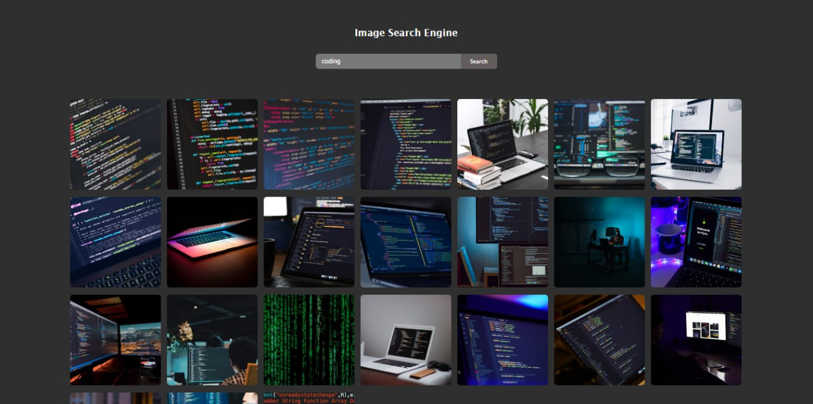

# 🖼️ Image Search Engine

A simple **Image Search Engine** built with **HTML, CSS, and JavaScript**, powered by the [Unsplash API](https://unsplash.com/developers).  
Search for any keyword and instantly get beautiful images, with the option to load more results.

## 🚀 Features
- 🔍 Search images by keyword  
- 🌐 Fetch results using Unsplash API  
- 🖼️ Responsive grid layout for images  
- 📥 "Show More" button to load extra results  
- ✨ Clean and minimal UI  

## 🛠️ Tech Stack
- **HTML5**  
- **CSS3**  
- **JavaScript (ES6+)**  
- **Unsplash API**

## 📸 Screenshots

<p>
  
</p>

## ⚙️ Installation & Usage
1. Clone the repository  
   ```bash
   git clone https://github.com/anshika-pathak005/image-search-engine.git
   ```
2. Open the project folder
   ```bash
   cd image-search-engine
   ```
3. Open `index.html` in your browser
4. Start searching for images 🚀

## 🔑 API Key Setup

This project uses **Unsplash API**. To make it work:

1. Go to [Unsplash Developers](https://unsplash.com/developers).
2. Create a new application.
3. Copy your **Access Key**.
4. Replace the placeholder `APIkey` in `index.js` with your own key.
```js
const APIkey = "YOUR_ACCESS_KEY_HERE";
```

## 📂 Folder Structure

```
image-search-engine/
│── index.html
│── style.css
│── index.js
│── screenshots/
```
